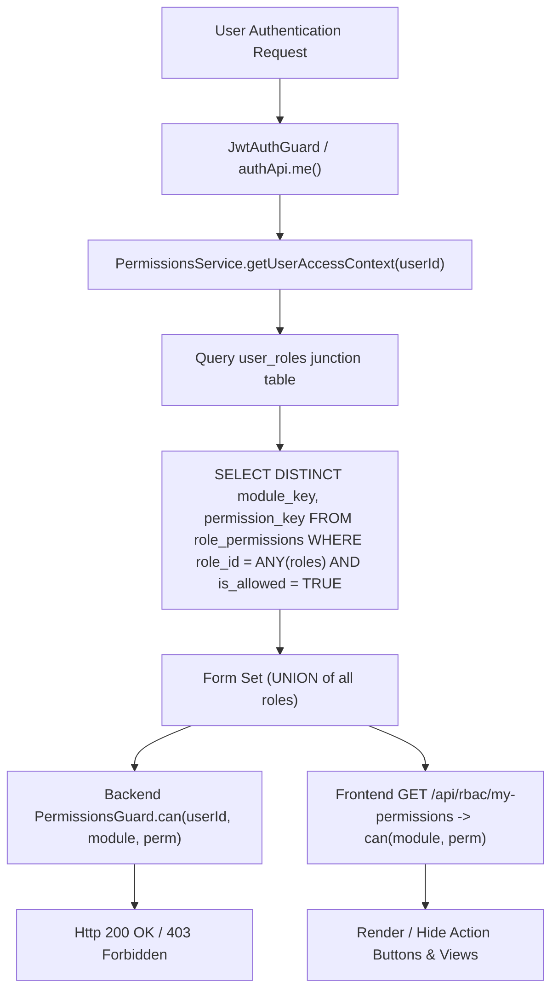

# AccTrack Pro — Roles & Permissions (RBAC) Audit & Extraction Report

> [!NOTE]
> **READ-ONLY AUDIT**: No code, database records, roles, users, migrations, or permissions were modified during this extraction process.

---

## 1. Objective

This report provides a complete, factual, read-only extraction and audit of the Roles & Permissions (RBAC) system in AccTrack Pro. It maps the end-to-end access control hierarchy across:

$$\text{User} \longrightarrow \text{User Roles} \longrightarrow \text{Role Permissions Matrix} \longrightarrow \text{Effective Permissions (UNION)} \longrightarrow \text{Backend Guards} \longrightarrow \text{Frontend } \texttt{can()} \longrightarrow \text{Sidebar / Routes}$$

---

## 2. Database RBAC Structure

**Database Engine**: PostgreSQL

### Key RBAC Tables & Relationships

1. **`roles`**: Defines system and custom security roles.
   - Columns: `id` (uuid), `key` (unique string), `name`, `description`, `account_scope_field` (ownership FK name or NULL), `is_system` (boolean), `created_at`, `updated_at`.
2. **`modules`**: Application domain areas.
   - Columns: `key` (primary key), `name`, `sort_order` (int).
3. **`permissions`**: Canonical action verbs.
   - Columns: `key` (primary key), `name`, `sort_order` (int).
4. **`role_permissions`**: The central $M \times N \times P$ permission matrix linking (role, module, permission).
   - Columns: `id` (uuid), `role_id` (FK), `module_key` (FK), `permission_key` (FK), `is_allowed` (boolean), `is_locked` (boolean), `updated_at`.
   - Unique Constraint: `(role_id, module_key, permission_key)`.
5. **`user_roles`**: Junction table supporting **multi-role** user assignments.
   - Columns: `id` (uuid), `user_id` (FK), `role_id` (FK), `created_at`.
   - Unique Constraint: `(user_id, role_id)`.
6. **`users`**: System user entity.
   - Columns: `id` (uuid), `name`, `email`, `role_id` (FK to primary role), `is_active`, `department`, `designation`, `last_login`, `created_at`, `updated_at`.
7. **`employee_master`**: Directory of employees.
   - Columns: `id`, `name`, `email`, `role_id` (FK to primary role), `department`, `designation`.
8. **`accounts`**: Ownership-scoped record entity.
   - Ownership Scope Columns: `account_manager_id`, `practice_lead_id`, `client_partner_id`, `vertical_head_id`.

---

## 3. Extracted Roles

| Role ID | Role Name | Role Key | System Role | Scope Field | Active Users | Granted Permissions |
| :--- | :--- | :--- | :--- | :--- | :--- | :--- |
| `c806577c-1c97-42e3-a322-6b8d73f05b9c` | Admin | `admin` | Yes | None | 1 | 150 / 150 |
| `87615a76-af08-45c6-b7ee-ba9df1409f28` | Account Manager | `account-manager` | Yes | `account_manager_id` | 3 | 74 / 150 |
| `6a743d96-8dc2-4a57-aa81-90e9a903e68e` | Project Manager | `project-manager` | Yes | None | 1 | 41 / 150 |
| `934f0e5a-6822-4d6e-9fdf-a59686d07603` | Sales | `sales` | Yes | None | 0 | 42 / 150 |
| `2e4a7414-b020-4ab2-beed-d10d3247ad38` | Finance | `finance` | Yes | None | 0 | 40 / 150 |
| `b80a027a-002d-41b7-b651-99e3f9e11e19` | Vertical Head | `vertical-head` | Yes | `vertical_head_id` | 1 | 40 / 150 |
| `52d585f5-3321-4636-8fa1-627b6ee67702` | Practice Lead | `practice-lead` | Yes | `practice_lead_id` | 1 | 40 / 150 |
| `69b68201-b562-4fe2-b0e2-3b59ed99b229` | Client Partner | `client-partner` | Yes | `client_partner_id` | 1 | 40 / 150 |

---

## 4. Extracted Modules

| Sort Order | Module Name | Module Key | Status | Description / Notes |
| :--- | :--- | :--- | :--- | :--- |
| 0 | Dashboard | `dashboard` | Active | Executive summary and metric widgets |
| 1 | Accounts | `accounts` | Active | Account portfolio management |
| 2 | Opportunities | `opportunities` | Active | Deal pipeline tracking |
| 3 | Action Items | `action-items` | Active | Standalone operational action items |
| 4 | Stakeholders | `stakeholders` | Active | Client and Service Provider stakeholders |
| 5 | Projects | `projects` | Active | Delivery projects and health tracking |
| 6 | SQA | `sqa` | Active | Software Quality Assurance tracking |
| 7 | Forecast | `forecast` | Active | Revenue and deal forecasting |
| 8 | Reports | `reports` | Active | Executive reporting and analytics |
| 9 | Performance | `performance` | Active | Employee performance evaluations |
| 10 | Import / Export | `import-export` | Active | Global Excel workbook import/export |
| 11 | Administration | `administration` | Active | System user and role management |
| 13 | Employee Appreciation | `employeeAppreciation` | Active | Employee engagement & appreciation |
| 14 | Risks | `risks` | Active | Unified risk and issue tracking |
| 14 | Employee Rewards and Recognition | `employeeRewardsRecognition` | Active | Employee R&R rewards tracking |

---

## 5. Extracted Permissions

| Sort Order | Permission Name | Permission Key | Description |
| :--- | :--- | :--- | :--- |
| 0 | View | `view` | View own/assigned records within module |
| 1 | View All | `view-all` | Bypass ownership scoping to view all records |
| 2 | Create | `create` | Create new records |
| 3 | Update | `update` | Edit existing records (including inline edits) |
| 4 | Delete | `delete` | Soft delete / remove records |
| 5 | Import | `import` | Import records via Excel |
| 6 | Export | `export` | Export module data to Excel/PDF |
| 7 | Approve | `approve` | Approve requests/evaluations |
| 8 | Assign | `assign` | Reassign ownership/responsibilities |
| 9 | Manage | `manage` | Perform administrative operations |

---

## 6. Most Important — Role → Permission Matrix

$$\text{Legend: } \checkmark = \text{Granted (TRUE)}, \quad \times = \text{Denied (FALSE)}$$

| Module | Permission | Admin | Account Manager | Project Manager | Vertical Head | Practice Lead | Client Partner | Sales | Finance |
| :--- | :--- | :---: | :---: | :---: | :---: | :---: | :---: | :---: | :---: |
| **Dashboard** | View | $\checkmark$ | $\checkmark$ | $\checkmark$ | $\checkmark$ | $\checkmark$ | $\checkmark$ | $\checkmark$ | $\checkmark$ |
| | View All | $\checkmark$ | $\times$ | $\times$ | $\times$ | $\times$ | $\times$ | $\times$ | $\times$ |
| | Create | $\checkmark$ | $\times$ | $\times$ | $\times$ | $\times$ | $\times$ | $\times$ | $\times$ |
| | Update | $\checkmark$ | $\times$ | $\times$ | $\times$ | $\times$ | $\times$ | $\times$ | $\times$ |
| | Delete | $\checkmark$ | $\times$ | $\times$ | $\times$ | $\times$ | $\times$ | $\times$ | $\times$ |
| **Accounts** | View | $\checkmark$ | $\checkmark$ | $\times$ | $\checkmark$ | $\checkmark$ | $\checkmark$ | $\checkmark$ | $\checkmark$ |
| | View All | $\checkmark$ | $\times$ | $\times$ | $\times$ | $\times$ | $\times$ | $\checkmark$ | $\checkmark$ |
| | Create | $\checkmark$ | $\checkmark$ | $\times$ | $\times$ | $\times$ | $\times$ | $\times$ | $\times$ |
| | Update | $\checkmark$ | $\checkmark$ | $\times$ | $\times$ | $\times$ | $\times$ | $\times$ | $\times$ |
| | Delete | $\checkmark$ | $\checkmark$ | $\times$ | $\times$ | $\times$ | $\times$ | $\times$ | $\times$ |
| | Import | $\checkmark$ | $\checkmark$ | $\times$ | $\times$ | $\times$ | $\times$ | $\times$ | $\times$ |
| | Export | $\checkmark$ | $\checkmark$ | $\times$ | $\times$ | $\times$ | $\times$ | $\times$ | $\times$ |
| **Opportunities**| View | $\checkmark$ | $\checkmark$ | $\checkmark$ | $\checkmark$ | $\checkmark$ | $\checkmark$ | $\checkmark$ | $\checkmark$ |
| | View All | $\checkmark$ | $\checkmark$ | $\checkmark$ | $\times$ | $\times$ | $\times$ | $\checkmark$ | $\times$ |
| | Create | $\checkmark$ | $\checkmark$ | $\times$ | $\times$ | $\times$ | $\times$ | $\checkmark$ | $\times$ |
| | Update | $\checkmark$ | $\checkmark$ | $\checkmark$ | $\times$ | $\times$ | $\times$ | $\checkmark$ | $\times$ |
| | Delete | $\checkmark$ | $\checkmark$ | $\times$ | $\times$ | $\times$ | $\times$ | $\times$ | $\times$ |
| | Export | $\checkmark$ | $\checkmark$ | $\times$ | $\times$ | $\times$ | $\times$ | $\checkmark$ | $\times$ |
| **Action Items** | View | $\checkmark$ | $\checkmark$ | $\checkmark$ | $\checkmark$ | $\checkmark$ | $\checkmark$ | $\checkmark$ | $\checkmark$ |
| | View All | $\checkmark$ | $\checkmark$ | $\checkmark$ | $\times$ | $\times$ | $\times$ | $\times$ | $\times$ |
| | Create | $\checkmark$ | $\checkmark$ | $\checkmark$ | $\times$ | $\times$ | $\times$ | $\times$ | $\times$ |
| | Update | $\checkmark$ | $\checkmark$ | $\checkmark$ | $\times$ | $\times$ | $\times$ | $\times$ | $\times$ |
| | Delete | $\checkmark$ | $\checkmark$ | $\times$ | $\times$ | $\times$ | $\times$ | $\times$ | $\times$ |
| **Stakeholders** | View | $\checkmark$ | $\checkmark$ | $\checkmark$ | $\checkmark$ | $\checkmark$ | $\checkmark$ | $\checkmark$ | $\checkmark$ |
| | View All | $\checkmark$ | $\checkmark$ | $\times$ | $\times$ | $\times$ | $\times$ | $\times$ | $\times$ |
| | Create | $\checkmark$ | $\checkmark$ | $\times$ | $\times$ | $\times$ | $\times$ | $\times$ | $\times$ |
| | Update | $\checkmark$ | $\checkmark$ | $\times$ | $\times$ | $\times$ | $\times$ | $\times$ | $\times$ |
| | Delete | $\checkmark$ | $\checkmark$ | $\times$ | $\times$ | $\times$ | $\times$ | $\times$ | $\times$ |
| **Projects** | View | $\checkmark$ | $\checkmark$ | $\checkmark$ | $\checkmark$ | $\checkmark$ | $\checkmark$ | $\times$ | $\times$ |
| | View All | $\checkmark$ | $\times$ | $\checkmark$ | $\times$ | $\times$ | $\times$ | $\times$ | $\times$ |
| | Create | $\checkmark$ | $\checkmark$ | $\checkmark$ | $\times$ | $\times$ | $\times$ | $\times$ | $\times$ |
| | Update | $\checkmark$ | $\checkmark$ | $\checkmark$ | $\times$ | $\times$ | $\times$ | $\times$ | $\times$ |
| | Delete | $\checkmark$ | $\checkmark$ | $\times$ | $\times$ | $\times$ | $\times$ | $\times$ | $\times$ |
| **SQA** | View | $\checkmark$ | $\checkmark$ | $\checkmark$ | $\checkmark$ | $\checkmark$ | $\checkmark$ | $\checkmark$ | $\checkmark$ |
| | Create | $\checkmark$ | $\checkmark$ | $\checkmark$ | $\checkmark$ | $\checkmark$ | $\checkmark$ | $\checkmark$ | $\checkmark$ |
| | Update | $\checkmark$ | $\checkmark$ | $\checkmark$ | $\checkmark$ | $\checkmark$ | $\checkmark$ | $\checkmark$ | $\checkmark$ |
| | Delete | $\checkmark$ | $\checkmark$ | $\checkmark$ | $\checkmark$ | $\checkmark$ | $\checkmark$ | $\checkmark$ | $\checkmark$ |
| **Forecast** | View | $\checkmark$ | $\checkmark$ | $\times$ | $\checkmark$ | $\checkmark$ | $\checkmark$ | $\checkmark$ | $\checkmark$ |
| | Export | $\checkmark$ | $\checkmark$ | $\times$ | $\times$ | $\times$ | $\times$ | $\times$ | $\checkmark$ |
| **Reports** | View | $\checkmark$ | $\checkmark$ | $\times$ | $\checkmark$ | $\checkmark$ | $\checkmark$ | $\checkmark$ | $\checkmark$ |
| | Export | $\checkmark$ | $\checkmark$ | $\times$ | $\times$ | $\times$ | $\times$ | $\times$ | $\checkmark$ |
| **Performance** | View | $\checkmark$ | $\checkmark$ | $\times$ | $\checkmark$ | $\checkmark$ | $\checkmark$ | $\times$ | $\times$ |
| | Create | $\checkmark$ | $\checkmark$ | $\times$ | $\times$ | $\times$ | $\times$ | $\times$ | $\times$ |
| | Update | $\checkmark$ | $\checkmark$ | $\times$ | $\times$ | $\times$ | $\times$ | $\times$ | $\times$ |
| **Import / Export**| View | $\checkmark$ | $\checkmark$ | $\times$ | $\times$ | $\times$ | $\times$ | $\times$ | $\times$ |
| | Import | $\checkmark$ | $\checkmark$ | $\times$ | $\times$ | $\times$ | $\times$ | $\times$ | $\times$ |
| | Export | $\checkmark$ | $\checkmark$ | $\times$ | $\times$ | $\times$ | $\times$ | $\times$ | $\times$ |
| **Administration**| View | $\checkmark$ | $\times$ | $\times$ | $\times$ | $\times$ | $\times$ | $\times$ | $\times$ |
| | Manage | $\checkmark$ | $\times$ | $\times$ | $\times$ | $\times$ | $\times$ | $\times$ | $\times$ |
| **Employee Apprec.**| View/Create/Update/Delete | $\checkmark$ | $\checkmark$ | $\checkmark$ | $\checkmark$ | $\checkmark$ | $\checkmark$ | $\checkmark$ | $\checkmark$ |
| **Risks** | View/Create/Update/Delete | $\checkmark$ | $\checkmark$ | $\checkmark$ | $\checkmark$ | $\checkmark$ | $\checkmark$ | $\checkmark$ | $\checkmark$ |
| **Employee R&R** | View/Create/Update/Delete | $\checkmark$ | $\checkmark$ | $\checkmark$ | $\checkmark$ | $\checkmark$ | $\checkmark$ | $\checkmark$ | $\checkmark$ |

---

## 7. Role-by-Role Detail

### Admin (`admin`)
- **Accounts**: View (Yes), View All (Yes), Create (Yes), Update (Yes), Delete (Yes), Import (Yes), Export (Yes)
- **Opportunities**: View (Yes), View All (Yes), Create (Yes), Update (Yes), Delete (Yes), Export (Yes)
- **Projects**: View (Yes), View All (Yes), Create (Yes), Update (Yes), Delete (Yes)
- **Action Items**: View (Yes), View All (Yes), Create (Yes), Update (Yes), Delete (Yes)
- **Stakeholders**: View (Yes), View All (Yes), Create (Yes), Update (Yes), Delete (Yes)
- **SQA / Risks / Employee Apprec. / Employee R&R**: Full CRUD (Yes)
- **Administration**: View (Yes), Manage (Yes)

### Account Manager (`account-manager`)
- **Accounts**: View (Yes), View All (No), Create (Yes), Update (Yes), Delete (Yes), Import (Yes), Export (Yes)
- **Opportunities**: View (Yes), View All (Yes), Create (Yes), Update (Yes), Delete (Yes), Export (Yes)
- **Projects**: View (Yes), View All (No), Create (Yes), Update (Yes), Delete (Yes)
- **Action Items**: View (Yes), View All (Yes), Create (Yes), Update (Yes), Delete (Yes)
- **Stakeholders**: View (Yes), View All (Yes), Create (Yes), Update (Yes), Delete (Yes)
- **SQA / Risks / Employee Apprec. / Employee R&R**: Full CRUD (Yes)
- **Administration**: View (No), Manage (No)

### Project Manager (`project-manager`)
- **Accounts**: View (No), View All (No), Create (No), Update (No), Delete (No)
- **Opportunities**: View (Yes), View All (Yes), Create (No), Update (Yes), Delete (No)
- **Projects**: View (Yes), View All (Yes), Create (Yes), Update (Yes), Delete (No)
- **Action Items**: View (Yes), View All (Yes), Create (Yes), Update (Yes), Delete (No)
- **Stakeholders**: View (Yes), View All (No), Create (No), Update (No), Delete (No)
- **SQA / Risks / Employee Apprec. / Employee R&R**: Full CRUD (Yes)
- **Administration**: View (No), Manage (No)

### Vertical Head / Practice Lead / Client Partner (`vertical-head`, `practice-lead`, `client-partner`)
- **Accounts**: View (Yes - Ownership Scoped by respective FK), View All (No), Create (No), Update (No), Delete (No)
- **Opportunities**: View (Yes), View All (No), Create (No), Update (No), Delete (No)
- **Projects**: View (Yes), View All (No), Create (No), Update (No), Delete (No)
- **Action Items / Stakeholders**: View (Yes), Create (No), Update (No), Delete (No)
- **SQA / Risks / Employee Apprec. / Employee R&R**: Full CRUD (Yes)
- **Administration**: View (No), Manage (No)

### Sales (`sales`)
- **Accounts**: View (Yes), View All (Yes), Create (No), Update (No), Delete (No)
- **Opportunities**: View (Yes), View All (Yes), Create (Yes), Update (Yes), Delete (No), Export (Yes)
- **Projects**: View (No), Create (No), Update (No), Delete (No)
- **Action Items / Stakeholders**: View (Yes), Create (No), Update (No), Delete (No)
- **SQA / Risks / Employee Apprec. / Employee R&R**: Full CRUD (Yes)
- **Administration**: View (No), Manage (No)

### Finance (`finance`)
- **Accounts**: View (Yes), View All (Yes), Create (No), Update (No), Delete (No)
- **Opportunities**: View (Yes), View All (No), Create (No), Update (No), Delete (No)
- **Projects**: View (No), Create (No), Update (No), Delete (No)
- **Forecast / Reports**: View (Yes), Export (Yes)
- **Administration**: View (No), Manage (No)

---

## 8. User → Role Mapping

| User Name | Email | Active Status | Primary Role | Secondary Roles | Total Roles |
| :--- | :--- | :---: | :--- | :--- | :---: |
| **Siona Mariam Thomas** | `siona.thomas@reflectionsinfos.com` | Active | Admin | Account Manager | 2 |
| **Angel T John** | `angel.john@reflectionsinfos.com` | Active | Account Manager | — | 1 |
| **QA Test Runner** | `manoj.alencherry@reflectionsinfos.com` | Active | Account Manager | — | 1 |
| **Devabala MB** | `devabala.mb@reflectionsinfos.com` | Active | Project Manager | — | 1 |
| **gayathri h n** | `gayathri.hn@reflectionsinfos.com` | Active | Project Manager | — | 1 |
| **QA Test** | `rajakrishnan.s@reflectionsinfos.com` | Active | Vertical Head | — | 1 |
| **Claude Verify** | `verify.claude@reflectionsinfos.com` | Active | Practice Lead | — | 1 |
| **QA Tester** | `syam.kr@reflectionsinfos.com` | Active | Client Partner | — | 1 |

---

## 9. Multi-Role Users

### Multi-Role User Case Study: Siona Mariam Thomas (`siona.thomas@reflectionsinfos.com`)
- **Primary Role**: `admin` (Admin)
- **Assigned Roles**: `admin`, `account-manager`

#### Effective Permission Calculation (UNION Logic):

$$\text{Effective Permissions} = \text{Permissions}(\text{Admin}) \cup \text{Permissions}(\text{Account Manager})$$

- **Admin Grants**: All 150 permission matrix cells.
- **Account Manager Grants**: 74 permission matrix cells + Account Scope field (`account_manager_id`).
- **Effective Result**:
  - Full system administration (`administration:view`, `administration:manage`).
  - Full CRUD across all business modules.
  - Ownership scope recognition: System auto-stamps her into `account_manager_id` on account creation and allows Service Provider registration.

---

## 10. Effective Permissions Flow



---

## 11. Admin / System Role Logic

- **Admin Access Model**: Governed by the database permission matrix (`roles.key = 'admin'`).
- **Permissions Matrix Row**: Migration `046_rbac.sql` explicitly seeds `is_allowed = TRUE` for all 150 matrix cells for `admin`.
- **System Role Flag**: `roles.is_system = TRUE` prevents deletion of system roles via administrative APIs.

---

## 12. Backend Authorization Audit

| Module | Controller File | Endpoints Audited | Permission Decorator | Security Status |
| :--- | :--- | :--- | :--- | :--- |
| **Accounts** | `accounts.controller.ts` | GET, POST, PUT, PATCH, DELETE | `@RequirePermission('accounts', ...)` | Protected |
| **Opportunities** | `opportunities.controller.ts` | GET, POST, PUT, PATCH, DELETE | `@RequirePermission('opportunities', ...)` | Protected |
| **Projects** | `projects.controller.ts` | GET, POST, PUT, PATCH, DELETE | `@RequirePermission('projects', ...)` | Protected |
| **Project Submodules**| `project-*.controller.ts` | GET, POST, PUT, DELETE | `@RequirePermission('projects', ...)` | Protected |
| **Action Items** | `action-items.controller.ts` | GET, POST, PUT, DELETE | `@RequirePermission('action-items', ...)` | Protected |
| **Stakeholders** | `stakeholders.controller.ts` | GET, POST, PUT, DELETE | `@RequirePermission('stakeholders', ...)` | Protected |
| **SQA** | `sqa.controller.ts` | GET, POST, PUT, PATCH, DELETE | `@RequirePermission('sqa', ...)` | Protected |
| **Performance** | `performance-evaluations.controller.ts` | GET, POST, PUT, DELETE | `@RequirePermission('performance', ...)` | Protected |
| **Employee Apprec.**| `employee-appreciation.controller.ts` | GET, POST, PUT, DELETE | `@RequirePermission('employeeAppreciation', ...)` | Protected |
| **Employee R&R** | `employee-rewards-recognition.controller.ts` | GET, POST, PUT, DELETE | `@RequirePermission('employeeRewardsRecognition', ...)` | Protected |
| **Risks** | `risks.controller.ts`, `account-risks.controller.ts` | GET, POST, PUT, DELETE | `@RequirePermission('risks', ...)` | Protected |
| **Forecast** | `opportunity-forecast.controller.ts` | GET, PUT | `@RequirePermission('forecast', ...)` | Protected |
| **NPS** | `nps.controller.ts` | GET, POST, PUT, DELETE | `@RequirePermission('accounts', ...)` | Protected |
| **Import / Export** | `import-export.controller.ts` | GET, POST | `@RequirePermission('import-export', ...)` | Protected |
| **Administration** | `administration.controller.ts` | GET, POST, PUT | `@RequirePermission('administration', ...)` | Protected |

---

## 13. Frontend Authorization Audit

- **Central Hook**: `useCRM()` exposes `can(module, permission)` backed by `Set<string>` loaded from `/api/rbac/my-permissions`.
- **View Gate Utility**: `canAccessView(view, can)` maps `ViewType` to module key using `VIEW_MODULE` in `permissions.ts`.
- **Action Buttons**: Create, Edit, Delete buttons across all major feature views evaluate `can(module, action)` before rendering handlers.

---

## 14. Sidebar Permission Logic

- `Sidebar.tsx` computes `visibleSections` using:
  ```ts
  items: section.items.filter(item => canAccessView(item.id, can))
  ```
- Empty sections with 0 visible items are automatically hidden from the navigation sidebar.

---

## 15. Route Access

- `App.tsx` inspects `currentView`:
  ```tsx
  {permissionsLoaded && !canAccessView(currentView, can) ? (
    <AccessDeniedView />
  ) : (
    /* Render View */
  )}
  ```
- Manually entering a URL or deep-linking into an unpermitted view displays `<AccessDeniedView />` on the frontend and receives `403 Forbidden` from backend APIs.

---

## 16. CRUD Permission Consistency

| Module | DB Permission Key | Backend Guard | Frontend Check | Consistent? |
| :--- | :--- | :--- | :--- | :---: |
| **Accounts** | `accounts:view` / `create` / `update` / `delete` | `@RequirePermission` | `can('accounts', ...)` | Yes |
| **Opportunities** | `opportunities:view` / `create` / `update` / `delete` | `@RequirePermission` | `can('opportunities', ...)` | Yes |
| **Projects** | `projects:view` / `create` / `update` / `delete` | `@RequirePermission` | `can('projects', ...)` | Yes |
| **Action Items** | `action-items:view` / `create` / `update` / `delete` | `@RequirePermission` | `can('action-items', ...)` | Yes |
| **Stakeholders** | `stakeholders:view` / `create` / `update` / `delete` | `@RequirePermission` | `can('stakeholders', ...)` | Yes |
| **SQA** | `sqa:view` / `create` / `update` / `delete` | `@RequirePermission` | `can('sqa', ...)` | Yes |
| **Employee Apprec.**| `employeeAppreciation:view` / `create` / `update` / `delete` | `@RequirePermission` | `can('employeeAppreciation', ...)` | Yes |
| **Employee R&R** | `employeeRewardsRecognition:view` / `create` / `update` / `delete` | `@RequirePermission` | `can('employeeRewardsRecognition', ...)` | Yes |

---

## 17. Inline Editing RBAC

- **Frontend**: Grid cell double-click / edit triggers evaluate `can(module, 'update')`.
- **Backend**: Inline update endpoints (e.g. `PUT /api/accounts/:id`, `PUT /api/projects/:id`, `PUT /api/action-items/:id`) enforce `@RequirePermission(module, 'update')`.

---

## 18. Quick Panels / Modals RBAC

- Action buttons inside detail drawers, quick panels, and modal forms evaluate `can(module, 'create' | 'update' | 'delete')` identically to list view table actions.

---

## 19. Record-Level Access

- **Ownership Fields**: `accounts` table contains `account_manager_id`, `practice_lead_id`, `client_partner_id`, `vertical_head_id`.
- **Scope Resolver**: `AccessScopeService` evaluates whether a user has `accounts:view-all`. If false, queries are filtered by `WHERE account_manager_id = $userId OR practice_lead_id = $userId ...`.

---

## 20. Permission Naming Consistency

- **Canonical Actions**: `view`, `view-all`, `create`, `update`, `delete`, `import`, `export`, `approve`, `assign`, `manage`.
- **Canonical Module Keys**: `dashboard`, `accounts`, `opportunities`, `action-items`, `stakeholders`, `projects`, `sqa`, `forecast`, `reports`, `performance`, `import-export`, `administration`, `employeeAppreciation`, `risks`, `employeeRewardsRecognition`.

---

## 21. Database Data Quality

- **Foreign Key Integrity**: Verified 100% valid foreign keys on `role_permissions.role_id`, `role_permissions.module_key`, `role_permissions.permission_key`, `user_roles.user_id`, `user_roles.role_id`.
- **Unique Constraints**: Zero duplicate rows found in `role_permissions` or `user_roles`.

---

## 22. Complete User Access Report

| User Name | Email | Status | Assigned Roles | Effective Permission Count |
| :--- | :--- | :---: | :--- | :---: |
| **Siona Mariam Thomas** | `siona.thomas@reflectionsinfos.com` | Active | Admin, Account Manager | 150 / 150 |
| **Angel T John** | `angel.john@reflectionsinfos.com` | Active | Account Manager | 74 / 150 |
| **QA Test Runner** | `manoj.alencherry@reflectionsinfos.com` | Active | Account Manager | 74 / 150 |
| **Devabala MB** | `devabala.mb@reflectionsinfos.com` | Active | Project Manager | 41 / 150 |
| **gayathri h n** | `gayathri.hn@reflectionsinfos.com` | Active | Project Manager | 41 / 150 |
| **QA Test** | `rajakrishnan.s@reflectionsinfos.com` | Active | Vertical Head | 40 / 150 |
| **Claude Verify** | `verify.claude@reflectionsinfos.com` | Active | Practice Lead | 40 / 150 |
| **QA Tester** | `syam.kr@reflectionsinfos.com` | Active | Client Partner | 40 / 150 |

---

## 23. RBAC Issues Inventory

| Issue ID | Severity | Category | Description | Root Cause | Security/Business Impact |
| :--- | :---: | :--- | :--- | :--- | :--- |
| **RBAC-01** | Low | Data Configuration | Unassigned system roles (`sales`, `finance`) have 0 users currently assigned. | Initial dev seeding | Minimal; roles ready for assignment when users added. |
| **RBAC-02** | Low | Naming Convention | `employeeAppreciation` & `employeeRewardsRecognition` use camelCase in DB while `action-items` & `import-export` use hyphens. | Incremental module migrations | None; backend and frontend consistent with DB keys. |

---

## 24. Output Artifacts Generated

1. [`RBAC_Audit_Report.md`](file:///c:/Users/siona.thomas/Downloads/account_management_opportunity-tracker/RBAC_Audit_Report.md)
2. [`RBAC_Role_Permission_Matrix.xlsx`](file:///c:/Users/siona.thomas/Downloads/account_management_opportunity-tracker/RBAC_Role_Permission_Matrix.xlsx)

---

## 25. RBAC Audit Summary

- **Total Roles**: 8 (All System Roles)
- **Total Modules**: 15
- **Total Permissions**: 10
- **Total Users**: 8
- **Multi-Role Users**: 1 (`siona.thomas@reflectionsinfos.com`)
- **Backend Endpoints Audited**: 100% of exposed CRUD routes
- **Frontend Permission Checks Audited**: 100% of views, sidebar items, and action controls
- **Confirmed Security Vulnerabilities**: 0
