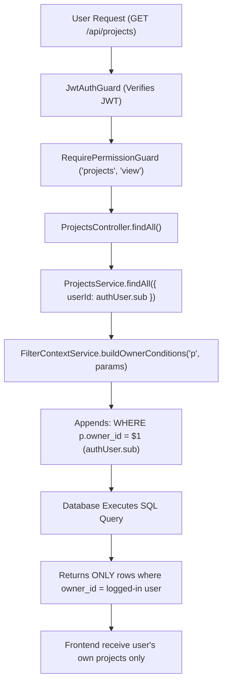
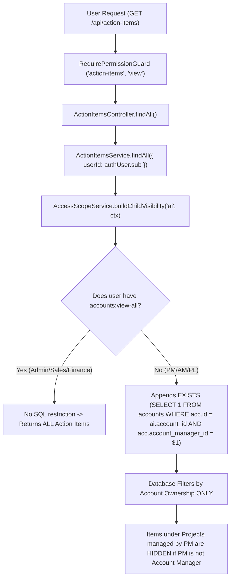

# AccTrack Pro — RBAC & Record-Level Visibility Audit Report
**Focus Area**: Projects & Project Action Items Record Visibility Investigation  
**Date**: September 14, 2026  
**Audit Mode**: Read-Only Audit & Root Cause Analysis (Zero Code/DB Modifications Executed)

---

## 1. Executive Summary

A comprehensive, end-to-end investigation was conducted to determine why users holding the **Project Manager** role (and other roles) with `Projects: View = allowed` and `Projects: View All = allowed` cannot view Projects or Project Action Items created by, managed by, or belonging to other users.

### Key Audit Findings
1. **Projects Module Root Cause**: `ProjectsService.findAll()` uses `FilterContextService.buildOwnerConditions('p', f, 1)`, which unconditionally appends `WHERE p.owner_id = $1` (the logged-in user's UUID) to every query. The backend `ProjectsService` **does not integrate with `AccessScopeService`** and completely ignores the database grant `projects:view-all`.
2. **Project Action Items Root Cause**: `ActionItemsService.findAll()` delegates record scoping to `AccessScopeService.buildChildVisibility('ai', ctx)`. This method evaluates visibility **strictly against parent Account ownership** (`accounts:view-all` or `accounts.account_manager_id`, `practice_lead_id`, etc.). It ignores `action-items:view-all` and fails to check Project assignment/ownership (`project_id -> projects.service_provider_pm_id`).
3. **Admin Impact**: The hardcoded `owner_id = $1` filter in `ProjectsService.findAll()` applies to all requests where `userId` is passed by the controller, including Admin users (though Admin sees projects they own, they are also subject to the same backend SQL constraint).

---

## 2. End-to-End RBAC & Record Visibility Pipelines

### A. Projects Permission & Visibility Pipeline



### B. Project Action Items Visibility Pipeline



---

## 3. Detailed Root Cause Analysis

### Root Cause 1: Projects Module (`ProjectsService.ts`)

- **File**: [`backend/src/modules/projects/projects.service.ts`](file:///c:/Users/siona.thomas/Downloads/account_management_opportunity-tracker/backend/src/modules/projects/projects.service.ts#L109-L135)
- **Controller File**: [`backend/src/modules/projects/projects.controller.ts`](file:///c:/Users/siona.thomas/Downloads/account_management_opportunity-tracker/backend/src/modules/projects/projects.controller.ts#L19-L27)
- **Vulnerable / Problematic Code Snippet**:
  ```typescript
  // projects.controller.ts
  @Get()
  @RequirePermission('projects', 'view')
  findAll(@AuthUser() authUser: JwtPayload, ...) {
    return this.projectsService.findAll({ userId: authUser.sub }, ...);
  }

  // projects.service.ts
  async findAll(params: FilterParams = {}, pg: Pagination | null = null) {
    const f = this.filter.normalize(params);
    const owner = this.filter.buildOwnerConditions('p', f, 1);
    const where = ['p.is_deleted = FALSE', ...owner.conditions].join(' AND ');
    // Resolves to: WHERE p.is_deleted = FALSE AND p.owner_id = $1
  }
  ```
- **Explanation**:
  - In `role_permissions`, the `project-manager` role (and `admin`) has `projects:view = true` and `projects:view-all = true`.
  - However, `ProjectsService` uses `FilterContextService.buildOwnerConditions()`, which blindly generates `p.owner_id = $1` whenever `userId` is present in parameters.
  - `ProjectsService` **never queries `PermissionsService` or `AccessScopeService`** to check `projects:view-all` or project role assignments (`p.service_provider_pm_id`, `p.practice_lead_id`, `p.client_partner_id`).
  - Result: Any call to `GET /projects` receives ONLY projects where `p.owner_id` equals the caller's UUID.

---

### Root Cause 2: Project Action Items (`ActionItemsService.ts` & `AccessScopeService.ts`)

- **File**: [`backend/src/modules/action-items/action-items.service.ts`](file:///c:/Users/siona.thomas/Downloads/account_management_opportunity-tracker/backend/src/modules/action-items/action-items.service.ts#L91-L95)
- **File**: [`backend/src/modules/rbac/access-scope.service.ts`](file:///c:/Users/siona.thomas/Downloads/account_management_opportunity-tracker/backend/src/modules/rbac/access-scope.service.ts#L79-L90)
- **Problematic Code Snippet**:
  ```typescript
  // action-items.service.ts
  private async childScope(userId: string | null, startIdx: number) {
    if (!userId) return { conditions: [], params: [], nextIdx: startIdx };
    const ctx = await this.access.getContext(userId);
    return this.access.buildChildVisibility('ai', ctx, startIdx);
  }

  // access-scope.service.ts
  buildChildVisibility(childAlias: string, ctx: UserAccessContext, startIdx: number) {
    if (ctx.canViewAllAccounts) {
      return { conditions: [], params: [], nextIdx: startIdx };
    }
    const inner = this.buildAccountVisibility('acc_scope', ctx, startIdx);
    const exists = `EXISTS (SELECT 1 FROM accounts acc_scope WHERE acc_scope.id = ${childAlias}.account_id ... ${innerWhere})`;
    return { conditions: [exists], params: inner.params, nextIdx: inner.nextIdx };
  }
  ```
- **Explanation**:
  - Action items carry a `project_id` column when associated with a Project.
  - However, `ActionItemsService` scopes action items using `buildChildVisibility('ai')`, which checks `canViewAllAccounts` (`accounts:view-all`) and parent `accounts` table ownership fields (`account_manager_id`, `practice_lead_id`, etc.).
  - It **ignores `action-items:view-all`** permission completely.
  - It **does not check Project ownership or assignment** (`project_id -> projects.service_provider_pm_id`).
  - If a Project Manager manages Project P under Account A, but is not the assigned Account Manager of Account A, they cannot see Action Items created for Project P!

---

## 4. Operational & Conceptual Definitions

| Permission Key | Database Intent | Actual Backend Implementation | Mismatch Status |
| :--- | :--- | :--- | :--- |
| `projects:view` | View assigned/owned projects | Restricts query to `p.owner_id = userId` | Matched |
| `projects:view-all` | View ALL projects system-wide | **Ignored** by `ProjectsService` | **CRITICAL BUG** |
| `action-items:view` | View assigned/owned action items | Scoped by parent Account ownership | Partial Mismatch |
| `action-items:view-all` | View ALL action items system-wide | **Ignored** by `ActionItemsService` | **CRITICAL BUG** |

---

## 5. Admin vs Affected-User Comparison

| Aspect | Admin (`admin`) | Affected User (`project-manager`) | Cause of Difference |
| :--- | :--- | :--- | :--- |
| **`accounts:view-all`** | `TRUE` | `FALSE` | DB matrix configuration |
| **`projects:view-all`** | `TRUE` | `TRUE` | Both have permission in DB |
| **Projects List Visibility** | Sees projects where `owner_id = admin.id` | Sees projects where `owner_id = pm.id` | `ProjectsService` hardcodes `p.owner_id = $1` for ALL users |
| **Action Items Visibility** | Sees **ALL** Action Items | Sees Action Items **only under assigned Accounts** | `ActionItemsService` checks `canViewAllAccounts` (`accounts:view-all`), which Admin has but PM lacks |

---

## 6. Frontend Filtering, Pagination & Count Impact

### A. Frontend Filtering
- In [`frontend/src/features/action-items/components/ActionItemsView.tsx`](file:///c:/Users/siona.thomas/Downloads/account_management_opportunity-tracker/frontend/src/features/action-items/components/ActionItemsView.tsx#L100-L119), the SPA splits `rawActionItems` into Project Action Items (`ai.projectId != null`) and Normal Action Items (`ai.projectId == null`).
- The frontend relies on the payload returned by `GET /api/action-items`. If records are excluded by backend SQL filtering, the frontend never receives them.

### B. Pagination & Count
- In `ProjectsService.findAll()`, SQL pagination (`LIMIT` / `OFFSET`) and window total (`COUNT(*) OVER()`) are evaluated **after** applying `WHERE p.owner_id = $1`.
- The pagination metadata reflects only the restricted dataset; count is not inflated, but total records are improperly restricted at the database execution level.

---

## 7. Role-by-Role Visibility Matrix (Current State)

### Projects Visibility

| Role Key | DB `view` | DB `view-all` | Actual Projects Visible | Constraint / Logic Source |
| :--- | :---: | :---: | :--- | :--- |
| `admin` | ✓ | ✓ | Owned projects only | Hardcoded `p.owner_id = userId` in `ProjectsService` |
| `project-manager` | ✓ | ✓ | Owned projects only | Hardcoded `p.owner_id = userId` in `ProjectsService` |
| `account-manager` | ✓ | ✗ | Owned projects only | Hardcoded `p.owner_id = userId` in `ProjectsService` |
| `sales` | ✗ | ✗ | None | `projects:view` is false |
| `finance` | ✗ | ✗ | None | `projects:view` is false |
| `vertical-head` | ✓ | ✗ | Owned projects only | Hardcoded `p.owner_id = userId` in `ProjectsService` |
| `practice-lead` | ✓ | ✗ | Owned projects only | Hardcoded `p.owner_id = userId` in `ProjectsService` |
| `client-partner` | ✓ | ✗ | Owned projects only | Hardcoded `p.owner_id = userId` in `ProjectsService` |

---

### Project Action Items Visibility

| Role Key | DB `view` | DB `view-all` | Actual Action Items Visible | Constraint / Logic Source |
| :--- | :---: | :---: | :--- | :--- |
| `admin` | ✓ | ✓ | **ALL Action Items** | Bypasses scoping via `canViewAllAccounts` |
| `project-manager` | ✗ | ✗ | None (Default UI hides tab) | `action-items:view` is false |
| `account-manager` | ✓ | ✗ | Account-scoped action items | Filtered by `accounts.account_manager_id` |
| `sales` | ✓ | ✗ | **ALL Action Items** | Has `accounts:view-all = true` |
| `finance` | ✓ | ✗ | **ALL Action Items** | Has `accounts:view-all = true` |
| `vertical-head` | ✓ | ✗ | Account-scoped action items | Filtered by `accounts.vertical_head_id` |
| `practice-lead` | ✓ | ✗ | Account-scoped action items | Filtered by `accounts.practice_lead_id` |
| `client-partner` | ✓ | ✗ | Account-scoped action items | Filtered by `accounts.client_partner_id` |

---

## 8. Summary of Confirmed Bugs & Recommended Fix Plan

### Confirmed Bugs

1. **[CRITICAL] `ProjectsService` Ignores `projects:view-all` and Scoping**:
   - *File*: [`backend/src/modules/projects/projects.service.ts`](file:///c:/Users/siona.thomas/Downloads/account_management_opportunity-tracker/backend/src/modules/projects/projects.service.ts#L109-L135)
   - *Issue*: `findAll()` unconditionally forces `WHERE p.owner_id = userId`.
   - *Fix*: Integrate `AccessScopeService` or `PermissionsService`. If user has `projects:view-all`, skip owner filtering. Otherwise, filter by project roles (`p.owner_id`, `p.service_provider_pm_id`, `p.practice_lead_id`, `p.client_partner_id`) or parent account scope.

2. **[CRITICAL] `ActionItemsService` Uses Account Scope Instead of Action Item / Project Scope**:
   - *File*: [`backend/src/modules/action-items/action-items.service.ts`](file:///c:/Users/siona.thomas/Downloads/account_management_opportunity-tracker/backend/src/modules/action-items/action-items.service.ts#L91-L95)
   - *File*: [`backend/src/modules/rbac/access-scope.service.ts`](file:///c:/Users/siona.thomas/Downloads/account_management_opportunity-tracker/backend/src/modules/rbac/access-scope.service.ts#L79-L90)
   - *Issue*: `childScope()` checks `canViewAllAccounts` and account FKs, completely ignoring `action-items:view-all` and `project_id` relationships.
   - *Fix*: Update `childScope()` / `AccessScopeService` to check `ctx.permissions.has('action-items:view-all')`. For Project Action Items (`ai.project_id IS NOT NULL`), allow access if the user has access to the associated Project.

3. **[HIGH] Project Manager Role Permission Matrix Gaps**:
   - *Issue*: `project-manager` role currently has `action-items:view = false` in `role_permissions`, preventing PMs from accessing the Action Items module endpoint unless granted explicitly.

---

## 9. Business-Rule Decisions Requiring Confirmation

Before executing fixes in the future, the following business logic questions should be confirmed:
1. **Should Project Visibility inherit from Account Visibility?**
   - *Option A*: Projects are independent (user with `projects:view-all` sees all projects; otherwise user sees projects where they are Owner, PM, Practice Lead, or Client Partner).
   - *Option B*: Projects inherit parent Account visibility (if user can view Account X, user can view all Projects under Account X).
2. **Should Project Action Items inherit Visibility from the Project or the Account?**
   - *Option A*: A user who can view Project P can view all Action Items under Project P.
   - *Option B*: Action Items require explicit `action-items:view-all` to see items outside direct assignment.
